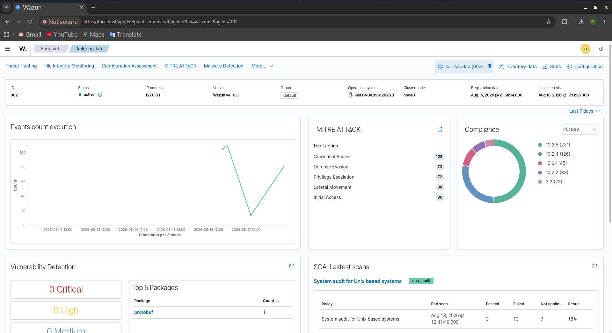
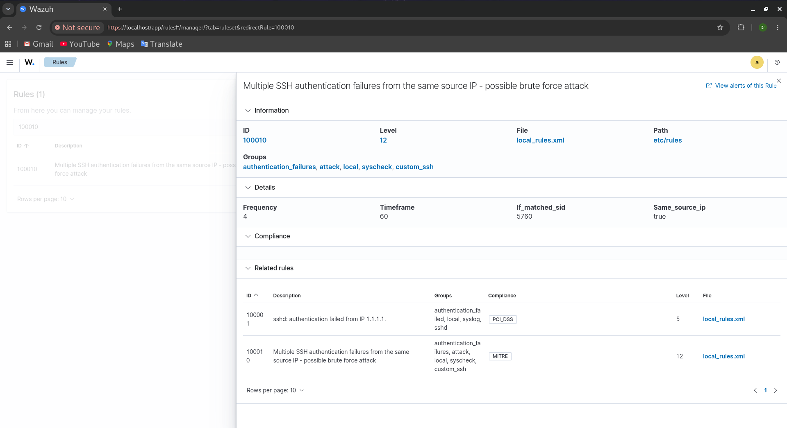
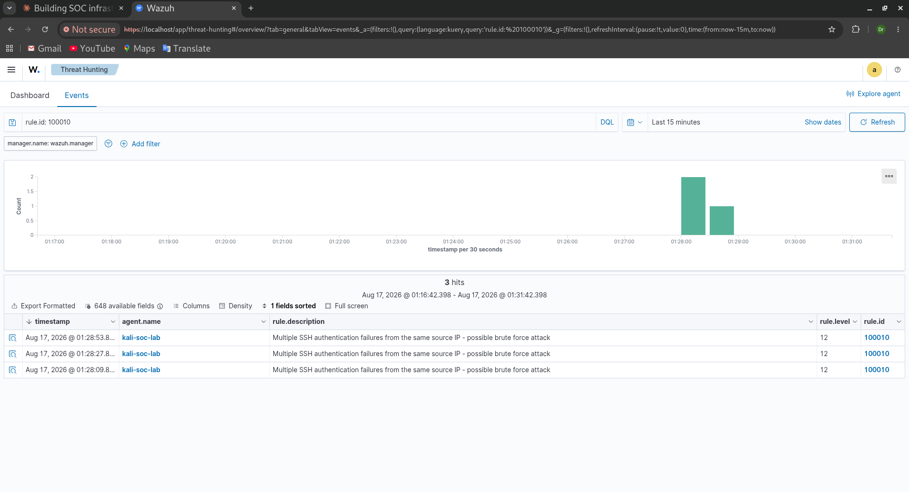
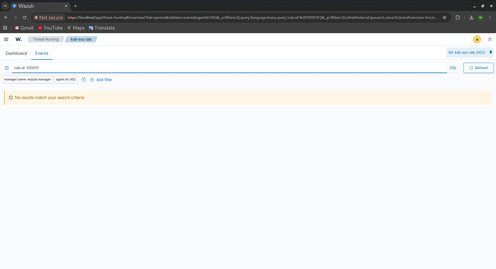
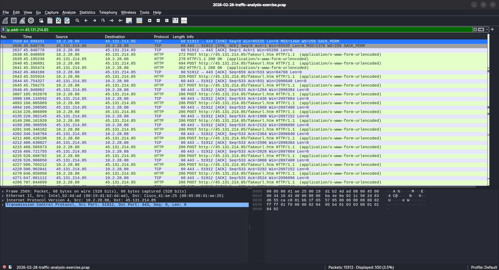
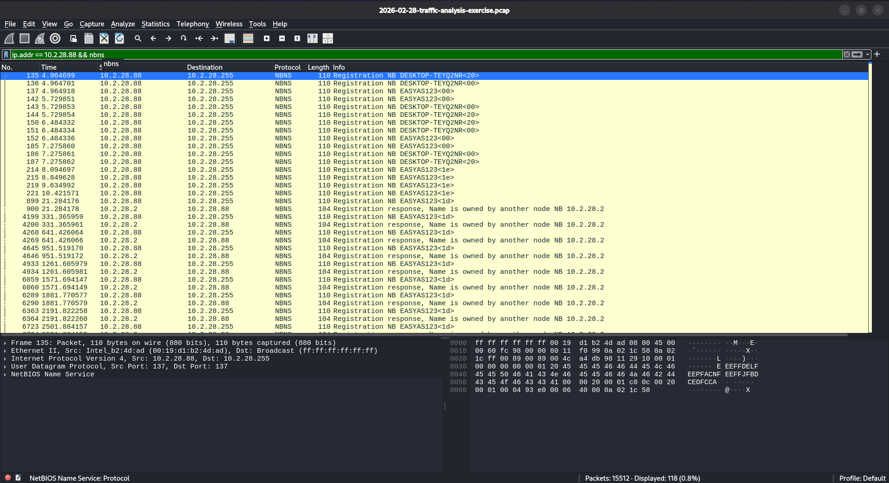
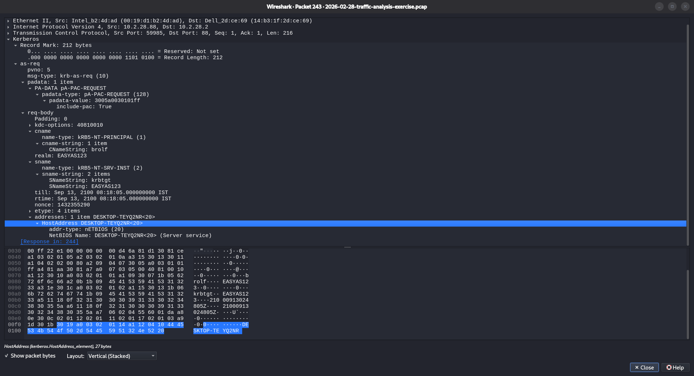
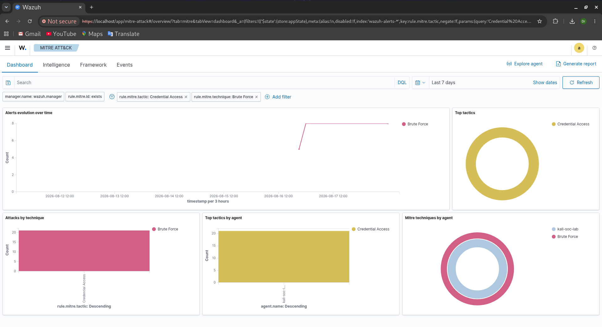

# SOC Infrastructure & SIEM Deployment Lab

A self-built Security Operations Center (SOC) lab covering SIEM deployment, custom detection engineering, network traffic analysis, and phishing investigation — built end-to-end using Wazuh SIEM on a Kali Linux environment.

## What this project demonstrates

- Deploying and configuring a full Wazuh SIEM stack (Manager, Indexer, Dashboard)
- Writing, debugging, and validating a custom detection rule from scratch (with both positive and negative test proof)
- Mapping detections to the MITRE ATT&CK framework
- Analyzing real network packet captures (PCAP) to trace a Command & Control (C2) infection back to a specific host and user
- Analyzing phishing emails for header-based and link-based indicators of compromise
- Writing incident reports in a real analyst format

---

## 1. SIEM Deployment

Wazuh Manager, Indexer, and Dashboard deployed via Docker, with an agent monitoring a Kali Linux endpoint (`kali-soc-lab`), actively reporting and generating alerts.



---

## 2. Custom Detection Rule — SSH Brute-Force Detection

Wazuh's default ruleset had no rule that correlated repeated SSH login failures **per source IP** into a single high-confidence brute-force alert. I wrote one.

**Rule file:** [`local_rules.xml`](local_rules.xml)

```xml
<rule id="100010" level="12" frequency="4" timeframe="60">
  <if_matched_sid>5760</if_matched_sid>
  <same_source_ip />
  <description>Multiple SSH authentication failures from the same source IP - possible brute force attack</description>
  <mitre>
    <id>T1110</id>
  </mitre>
  <group>authentication_failures,attack,</group>
</rule>
```

The rule triggers on 4+ failed SSH logins from the same source IP within 60 seconds, and is tagged to MITRE ATT&CK technique **T1110 (Brute Force)**.



### Validation

I tested the rule two ways to confirm the threshold behaves exactly as designed:

**Positive test** — 5 failed SSH logins → rule fires (3 alerts recorded, level 12):



**Negative test** — only 3 failed SSH logins (below threshold) → rule correctly stays silent:



---

## 3. Network Traffic Analysis — C2 Beacon Investigation

Full write-up: [`INCIDENT-REPORT.md`](INCIDENT-REPORT.md)

Using a public training PCAP simulating a NetSupport Manager RAT infection, I identified the C2 beacon pattern and traced it back to the infected host, matching all findings against the exercise's published answer key.

**C2 beacon traffic** — repeating HTTP POST requests to a malicious IP at a consistent ~60-second interval, disguised as port-443 traffic:



**Hostname discovery** via NBNS (NetBIOS Name Service):



**Username discovery** via Kerberos AS-REQ:



| Finding | Value |
|---|---|
| Infected host IP | `10.2.28.88` |
| MAC address | `00:19:d1:b2:4d:ad` |
| Hostname | `DESKTOP-TEYQ2NR` |
| Username | `brolf` (Becka Rolf) |
| C2 server | `45.131.214.85:443` |

---

## 4. Phishing Email Analysis

Full write-up: [`PHISHING-ANALYSIS.md`](PHISHING-ANALYSIS.md)

Analyzed a simulated credential-phishing email impersonating internal IT Support. Identified four independent indicators confirming the email as malicious:

- Sender domain spoofing (lookalike domain, not the real company domain)
- Reply-To mismatch (routes to an unrelated domain)
- Failed SPF, DKIM, and DMARC authentication checks
- Malicious link using a disguised subdomain to hide the true destination domain

---

## 5. MITRE ATT&CK Mapping

All detections generated in this lab were reviewed against the MITRE ATT&CK dashboard, filtered to isolate alerts specifically attributable to the custom rule (Tactic: Credential Access, Technique: Brute Force):



---

## Tools Used

Wazuh SIEM · Docker · Kali Linux · Wireshark · MITRE ATT&CK Framework

## Author

**Sohail Ali** — Aspiring SOC Analyst
[LinkedIn](https://linkedin.com/in/sohail-ali-cybersecurity)
